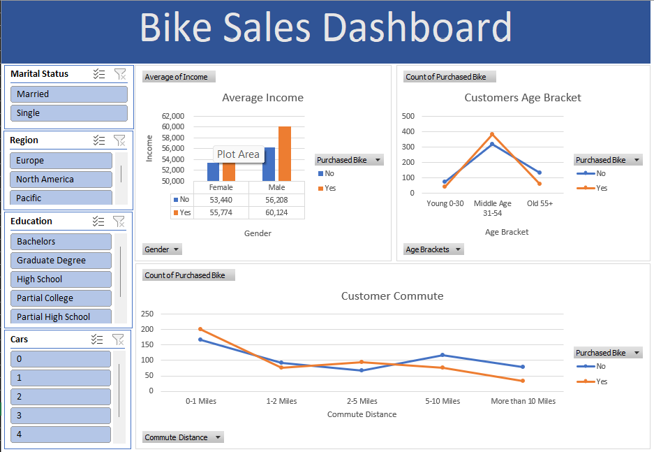

# Bike Sales Analysis & Excel Dashboard

## 📊 Project Overview

This project analyzes customer bike purchasing behavior using Microsoft Excel.

The objective is to identify patterns in bike purchases based on customer demographics, income, age group, commute distance, and other factors.

## 🛠️ Tools & Skills

- Microsoft Excel
- Data Cleaning
- Excel Formulas & Functions
- Pivot Tables
- Pivot Charts
- XLOOKUP
- VLOOKUP
- Conditional Formatting
- Data Visualization
- Slicers
- Interactive Dashboard

## 📌 Analysis Performed

- Analyzed average income of bike buyers and non-buyers
- Analyzed bike purchases by age group
- Analyzed bike purchases by commute distance
- Created Pivot Tables for data analysis
- Created charts for visualizing insights
- Built an interactive Excel dashboard using slicers

## 📈 Dashboard

## 🔍 Key Insights

- Analyzed purchasing behavior across different age groups.
- Compared average income between customers who purchased and did not purchase bikes.
- Analyzed the relationship between commute distance and bike purchases.
- Created an interactive dashboard for easier exploration of the data.

## 📂 Project Files

- `Bike_Sales_Analysis_Dashboard.xlsx` — Complete Excel analysis and dashboard
- `Screenshots/` — Dashboard and analysis screenshots
